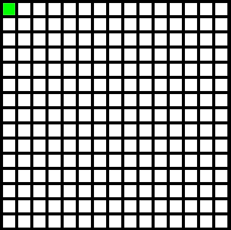

# Automatyczny saper
Zadaniem automatycznego sapera jest rozminowywanie terenu. Saper powinien rozpoznawać różne
rodzaje zagrożeń i podejmować odpowiednie decyzje w celu ich eliminacji.

## Opis
Saper przechodzi przez plansze wykorzystując algorytm DFS. Po wejściu na każde pole z pomocą sieci neurownowych rozpoznaje obrazek dopasowany do pola na któym się znajduje.
Jeśli natrafi na bombę na podstawie wylosowanych okoliczności dokonuje rozpoznania z pomocą drzewa decyzyjnego, co nalezy zrobić z bombą.

## Wykorzystane metody SI:
 * Sieci neuronowe (neural networks)
 * Drzewa decyzyjne (decision tree)
 * Algorytm DFS (DFS algorithm)

## Opis działania:
### Przed uruchomieniem:

### W trakcie działania:

### Po zakończeniu działania:

